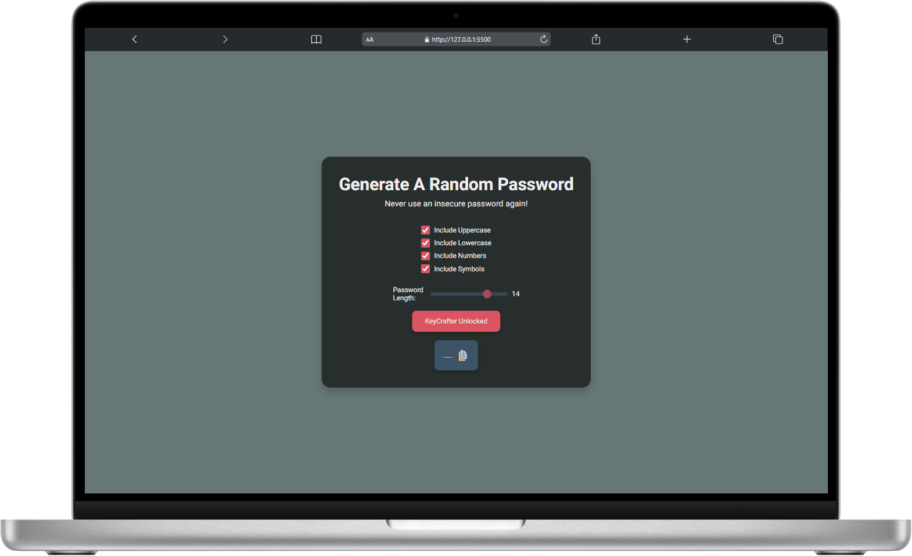
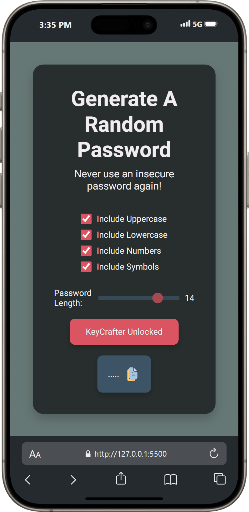

# **KeyCrafter**

## **Table of Contents**
- [Project Overview](#project-overview)
- [Features](#features)
- [Installation](#installation)
- [Usage](#usage)
- [Technologies Used](#technologies-used)
- [Screenshots](#screenshots)
- [License](#license)

## **Project Overview**
KeyCrafter is a web application that allows users to generate secure random passwords. It provides a user-friendly interface to customize the password generation process, including options for uppercase letters, lowercase letters, numbers, and symbols.

## **Features**
- Responsive design optimized for mobile and desktop devices.
- Customizable password generation with options for uppercase, lowercase, numbers, and symbols.
- Real-time password length adjustment using a slider.
- Copy generated password to clipboard with a single click.
- Modern UI components for a clean and engaging user experience.

## **Installation**

- Clone the repository.
- Navigate to the project directory: `cd KeyCrafter`
- Open `index.html` in your preferred web browser.

## **Usage**
Once the project is opened in your browser, you can use the KeyCrafter application to generate secure passwords.

- Select the desired options for uppercase, lowercase, numbers, and symbols.
- Adjust the password length using the slider.
- Click the "KeyCrafter Unlocked" button to generate a password.
- Click the copy icon to copy the generated password to the clipboard.

## **Technologies Used**

-  - Used for structuring the web page.
-  - Used for styling components.
-  - Used for interactivity and logic implementation.

## **Screenshots**

|  |  |
|:--------------------------------------------------:|:------------------------------------------------:|
| KeyCrafter on Desktop                              | KeyCrafter on Mobile                             |

## **License**
This project is licensed under the MIT License - see the [LICENSE](LICENSE) file for details.

<!-- IVIonsters Designs -->