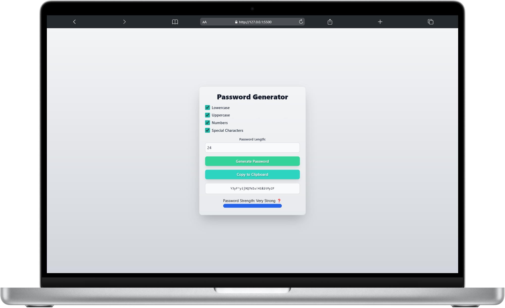
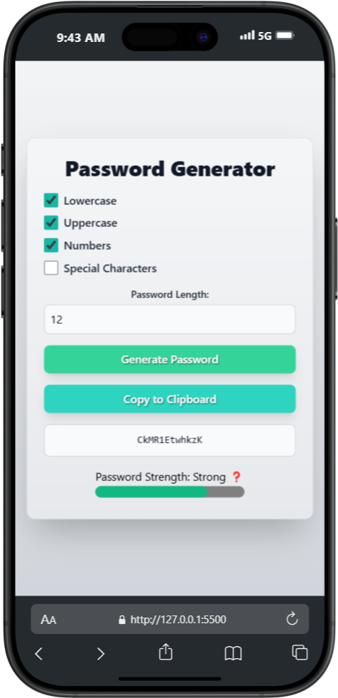

# **KeyCrafter**

## **Table of Contents**

- [Project Overview](#project-overview)
- [Features](#features)
- [Installation](#installation)
- [Usage](#usage)
- [Technologies Used](#technologies-used)
- [Screenshots](#screenshots)
- [License](#license)

## **Project Overview**

KeyCrafter is a feature-rich password generator designed to create secure and customizable passwords. This application offers a dynamic and interactive interface to enhance user experience, providing tools to tailor password complexity to individual preferences.

## **Features**

- Responsive design optimized for both mobile and desktop devices.
- Customizable password generation with options for:
  - Uppercase letters
  - Lowercase letters
  - Numbers
  - Special characters
- Adjustable password length (8–32 characters) with real-time validation.
- Copy generated password to clipboard with a single click.
- Password strength indicator that dynamically assesses quality based on length and character diversity.
- Avoids consecutive duplicate characters for improved security.
- Modern, clean UI components built with Tailwind CSS.

## **Installation**

- Clone the repository.
- Navigate to the project directory: `cd KeyCrafter`
- Open `index.html` in your preferred web browser.

## **Usage**

1. Open `index.html` in your browser.
2. Customize the password options:
   - Enable or disable character types (uppercase, lowercase, numbers, special characters).
   - Adjust the password length using the input field.
3. Click the **"Generate Password"** button to create a secure password.
4. Use the **"Copy to Clipboard"** button to copy the password for easy use.
5. Monitor the password strength via the integrated strength indicator.

## **Technologies Used**

-  - Used for structuring the web page.
-  - Used for styling components.
-  - Used for interactivity and logic implementation.
-  - Used for modern and responsive UI design.

## **Screenshots**

|  |  |
| :----------------------------------------------------------------: | :--------------------------------------------------------------: |
|                       KeyCrafter on Desktop                        |                       KeyCrafter on Mobile                       |

## **License**

This project is licensed under the MIT License - see the [LICENSE](LICENSE) file for details.

<!-- IVIonsters Designs -->
