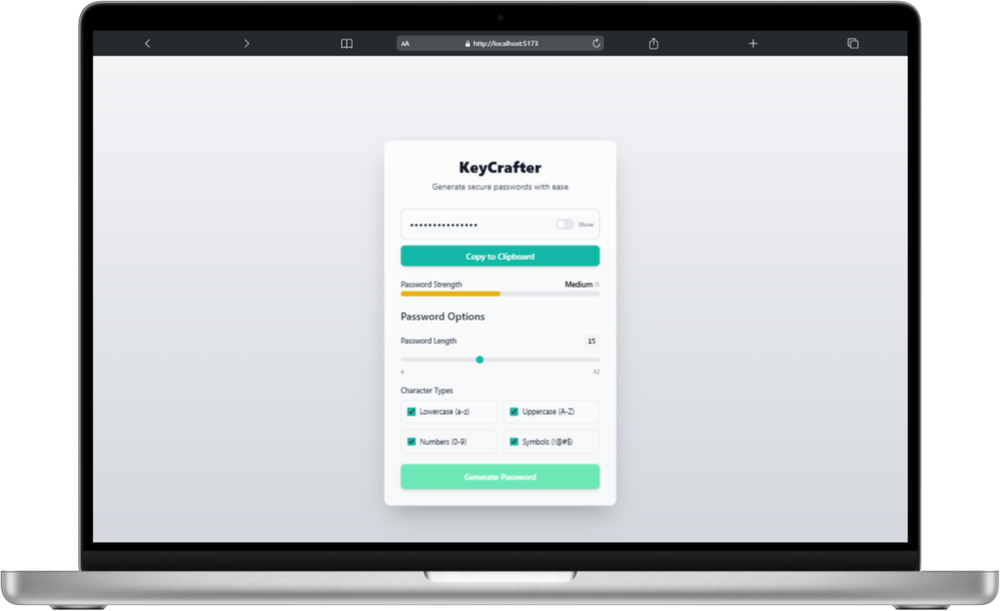
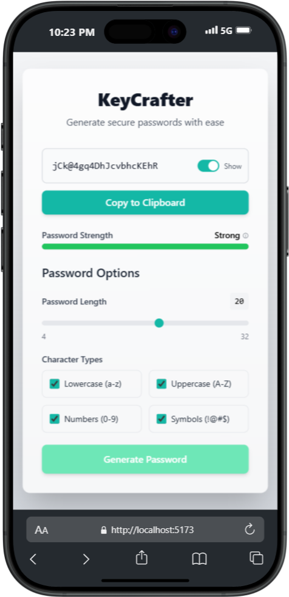
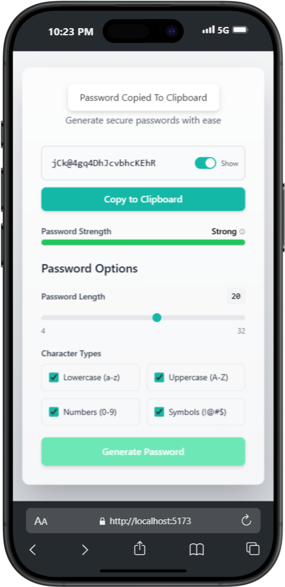

# **KeyCrafter**

## **Table of Contents**

- [Project Overview](#project-overview)
- [Features](#features)
- [Installation](#installation)
- [Usage](#usage)
- [Technologies Used](#technologies-used)
- [Screenshots](#screenshots)
- [License](#license)

## **Project Overview**

KeyCrafter is a modern password generator built with React, designed to create secure and customizable passwords. This application offers a dynamic and interactive interface to enhance user experience, providing tools to tailor password complexity to individual preferences.

## **Features**

- **Modern React-based UI** with responsive design for both mobile and desktop devices
- **Real-time password generation** based on user preferences
- **Customizable password options** including:
  - Uppercase letters
  - Lowercase letters
  - Numbers
  - Special characters
- **Interactive password length slider** (4-32 characters)
- **Visual password strength indicator** that dynamically assesses quality
- **Show/Hide password toggle** for enhanced security
- **Toast notifications** for user actions like copying passwords
- **Clean, intuitive interface** built with Tailwind CSS

## **Installation**

```bash
# Clone the repository
git clone https://github.com/yourusername/KeyCrafter.git

# Navigate to the project directory
cd KeyCrafter

# Install dependencies
npm install

# Start the development server
npm run dev
```

## **Usage**

1. Adjust the password length using the slider
2. Select character types to include (lowercase, uppercase, numbers, symbols)
3. Click "Generate Password" to create a secure password
4. Use the toggle switch to show/hide the password
5. Copy the password to clipboard with a single click
6. View the password strength indicator for security assessment

## **Technologies Used**

-  - Frontend library for building the user interface
-  - Next-generation frontend tooling
-  - Utility-first CSS framework
-  - Programming language
-  - Notification library

## **Project Structure**

```
KeyCrafter/
├── public/
├── src/
│   ├── components/
│   │   ├── CheckboxGroup.jsx     # Character options toggles
│   │   ├── PasswordDisplay.jsx   # Password display with copy/show functionality
│   │   ├── PasswordGenerator.jsx # Main component with generation logic
│   │   └── StrengthBar.jsx       # Password strength indicator
│   ├── App.jsx                   # Main application component
│   └── main.jsx                  # Application entry point
├── index.html
└── package.json
```

## **Screenshots**

|  |  |  |
| :----------------------------------------------: | :-------------------------------------------: | :------------------------------------------------: |
|              KeyCrafter on Desktop               |             KeyCrafter on iPhone              |           KeyCrafter Toast Notifications           |

## **Future Improvements**

- Add password history functionality
- Implement password saving with local storage
- Add accessibility features
- Support for generating passphrase-style passwords
- Add dark/light theme toggle

## **License**

This project is licensed under the MIT License - see the [LICENSE](LICENSE) file for details.

---

Made with ❤️ by Zachary
